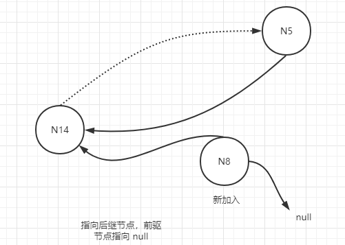

# 一致性Hash

# 1. 概述

> 分布式哈希表是 P2P 网络和分布式存储中常见的一项技术，是哈希表的分布式扩展，即考虑在多级分布式环境，每台机器负责承载部分数据的存储情形下，如何通过哈希方式来对数据进行CRUD等数据操作的方法。一致性 Hash 是实现其的一种方式。


如图所示是将哈希空间表示为长度为 5 (m = 5)的二进制数值的“一致性哈希”算法的示意图。因为 m = 5，所以其哈希空间可以表示的数值范围是 0~31，“一致性哈希”算法将哈希数值空间按照大小组成一个首尾相接的环状序列。对于每台机器，可以根据其 IP 和端口号经过哈希函数映射到哈希数值空间内，这样不同的机器就成了环状序列中的不同节点（图中的 N~i~ 表示不同的机器，i表示其哈希空间对应的数值)，而这台机器则负责存储落在一段有序哈希空间内的数据，比如 N~14~ 节点就存储主键经过哈希后落在 6~14 范围内的键值数据，而 N~5~ 节点则存储 30~31 以及 0~5 范围内的键值数据。同时，每个机器节点记录环中的前驱节点和后继节点地址位置，使之成为一个真正的有向环。

# 2. Route

通过以上方式，就可以将海量数据分布到集群中的不同机器节点中，实现数据分片功能。在P2P环境下意味着无中心管理节点，那么如何根据数据记录的主键以及哈希函数H来定位到记录内容呢?

一种直观的解决办法是沿着有向环顺序查找，接收到查询请求的节点根据哈希函数（假设H(key)=j)获得待查找主键的哈希值j，首先判断是否在自身管理范围内，如果不在，则将其转交给后继节点继续查找，如此循环，直到找到某个机器节点N~x~，x是大于等于j的最小编号节点，这样即使最多遍历所有机器节点也可以给出查找结果（返回对应的value值或者应答无该记录内容）。


但很明显这是一种低效率的查找方式，为了加快查找速度，可以在每个机器节点配置路由表，路由表存储m 条路由信息(m为哈希空间的二进制数值比特位长度，上面例子中m=5)，其中第i项(0≤i≤m-1)路由信息代表距离当前节点为2^i^的哈希空间数值所在的机器节点编号。比如对于上图例子中的N~14~节点，其对应的路由表信息如下:

| 距离     | 1(2^0^) | 2(2^1^) | 4(2^2^) | 8(2^3^) | 16(2^4^) |
| -------- | ------- | ------- | ------- | ------- | -------- |
| 机器节点 | N~20~   | N~20~   | N~20~   | N~25~   | N~5~     |

## 2.1 一致性哈希路由算法

输入:机器节点N~i~发起初始查询请求，查询主键key对应的键值．其中 H(key)=j。

输出:N~i~给出key对应的键值 value，或者返回键值不存在的信息。

算法:该算法通过不同节点之间发送消息来协作完成。假设当前执行操作的节点为N~c~，其初始值是N~i~，N~c~的后继节点为N~s~，重复执行下列步骤：

步骤1，判断是否c<j≤s，如果为真，则结束查找，说明key 如果存在，则在N~c~的后继节点N~s~上，所以N~c~发送消息给N~s~，查找key 的值 value，N~s~将查询结果返回给N~i~(注:每个消息都包含消息源N~i~的相关信息）。

步骤2，否则，N~c~查找其对应的路由表，找到小于j的最大编号节点N~h~(如果所有路由表都大于j、则选择第m-1项路由信息内的数据作为N~h~)，N~c~向N~h~发送消息，请求它代表N~i~查找key 的值value，N~h~此时成为当前节点N~c~，继续按照步骤1和步骤2递归进行查找操作。

# 3. 加入新节点


如果P2P网络中新加入一个机器节点N~new~、首先N~new~必须能够和目前P2P网络中任意一个节点N~x~建立联系，通过N~x~按照“路由问题”所述路由算法查询N~new~的对应哈希值 H(N~new~) =new，可以找到 N~new~ 的后继节点 N~s~，假设 N~s~ 的前驱节点为 N~p~，那么为了能够将 N~new~加入P2P网络，需要做两件事情：

其一，改变N~p~、N~new~和N~s~对应已经发生变化的前趋节点和后继节点记录,以体现新的网络架构。

其二，数据的重新分片与分布，具体而言就是将N~s~节点中存储的应该由N~new~承载的数据（即N~s~节点上哈希值小于等于new的记录)迁移到N~new~节点上。

在非并发环境下以上事务较易完成，但是如果在并发环境下，可能在N~p~和N~s~之间同时有多个新节点要加入，此时为了保证不出问题，完成上述两个任务可以按照以下两步操作。

步骤一，将N~new~的后继节点指向N~s~，前继节点置为空值null。

步骤二，这一步并非是专门为新加入节点设立的，而是所有节点周期性自动完成。这一步骤被称作稳定性检测（ Stabilization ) ，P2P网络中每个节点会定期执行，通过这个步骤可以完成前趋和后继节点的更新及数据迁移。对于节点N~c~来说，稳定性检测算法流程如下。

## 3.1 稳定性检测

步骤1，假设N~s~为N~c~的后继节点，N~c~向N~s~询问其前趋节点N~p~，N~s~向N~c~答复，一般情况下.如果这样则转第4步。

步骤2，如果N~p~介于N~c~和 N~s~之间，N~c~记录下N~p~为其后继节点。

步骤3，令N~x~是N~c~的当前后继节点，其可能是N~s~也可能是N~p~，这取决于步骤2的判断结果。如果N~x~的前趋节点为空或者N~c~位于N~x~和它的前趋节点之间，那么N~c~给N~x~发消息告诉N~x~说N~c~就是N~x~的前趋节点，N~x~将其前趋节点设置为N~c~。

步骤4，N~x~把其部分数据迁移到N~c~，即将N~x~上哈希值小于等于c的记录迁移到N~c~上。 

除了以上步骤，新加入节点后，原先节点的路由表可能不再正确，把本应该指向新加入节点的路由项指向了旧的几点，因此，每个节点需要周期性检查其路由表，对路由表内每一项 k=2^i^(0<=i<=m-1)加上本机节点编号执行路由算法，得到每个路由项经过查询获得的机器节点，如果与目前路由项保留内容不同则更新到新的内容，这样就完成了路由表的更新。新节点添加后初始路由表的更新也由此实现。

示例：新加入节点 N8




# 4. 节点离开

节点离开P2P网络有两种方式:正常离开与异常离开。正常离开的节点在离开前可以做些准备工作，包括通知相应节点更新其前趋和后继节点以及将本身持有数据迁移到后继节点上，由于其离开造成的其他机器路由表失效可以通过“加入新节点时的情形”介绍的方式获得更新。

异常离开往往是机器故障导致，此时故障机器保持的数据可能丢失，为了避免这个问题，可以采用将同一份数据在多台机器上保留副本的方式。

# 5. 虚拟节点


上述一致性哈希算法有两个潜在问题:机器节点映射到环状结构的位置是随机的，所以可能会导致机器负载不均衡;另外，在大规模数据中心中，机器异质性很常见，既有高性能、高配置机器,也有比较老型号的低配置机器，一致性哈希并未考虑到这种情况，将所有机器平等看待，所以可能存在低配置机器高负载的情形。Dynamo对一致性哈希进行了改造，引入“虚拟节点”的概念，即将一个物理节点虚拟成若干虚拟节点（对同一节点计算多个 Hash，可以在服务器ip或主机名后面增加编号来当做key），分别映射到一致性哈希的环状结构不同位置。这样一方面可以导致更佳的负载均衡，也可以兼顾到机器异质性问题。


虚拟节点还可以防止雪崩效应，假设不存在热点数据的时候，当前每台机器的承受的压力是M/2(假设每台机器的最高负载能力为M)，原本是不会有问题的，但是，这个时候A服务器由于有热点数据挂了，然后A的数据迁移至B，导致B所需要承受的压力变为M（还不考虑热点数据访问的压力），所以B是必挂的，然后C至少需要承受1.5M的压力，然后大家一起挂。造成此情形的原因在于一台机器挂了，那么他负责的数据都会被分配到一台机器上。虚拟节点可以把压力均匀的分在各个节点上。

通过以上一致性哈希工作原理的介绍，同时对比抽象模型可以看出，相比于 Round Robin数据分片方法，由于其将集群机器数目这一变量从哈希函数中移出,转而将机器及记录主键都映射到哈希数值空间，以此来建立机器与数据记录之间的映射关系。这相当于解除了机器与数据分布函数之间的直接耦合，加入了哈希空间作为解耦层( key-partition和 partition-machine映射采用同一个哈希函数)，这样不论是新加入机器还是机器故障导致某些机器失效，都只影响当前机器的后继节点上的数据分布，对于集群中其他机器中的数据无任何影响，所以大大增强了数据分片的灵活性。当然.由于其管理 PP网络的复杂性，也导致一致性哈希算法维护成本很高，这是其为提高数据分片灵活性带来的代价。

解决了数据分布的均匀性，但数据/key的均匀，不代表流量和负载的均匀。可能有的key访问量大，有的访问量小，导致实际节点负载并不均匀。

# 6. Code

## 6.1 无虚拟节点

```java
/**
 * @author yanwu
 * @version 1.0
 * @description ConsistentHash
 * @date 2022/7/28 22:02
 */
public class ConsistentHash {
    
    private static final Integer CYCLE_SIZE = 128;
    
    private static Machine[] machines = new Machine[]{
        new Machine("cache-server-1", "192.168.10.1"),
        new Machine("cache-server-2", "192.168.10.2"),
        new Machine("cache-server-3", "192.168.10.3"),
        new Machine("cache-server-4", "192.168.10.4")
    };
    
    private static SortedMap<Integer, Machine> sortedMap = new TreeMap<>();
    
    static {
        // 使用 TreeMap 代为实现有序，插入效率较慢(为了维护红黑树)
//        Stream.of(machines).forEach(machine -> sortedMap.put(machine.hashCode(), machine));
        // 面向对象
        Stream.of(machines).forEach(machine -> machine.setCirclePosition(hash(machine.hashCode())));
    }
    
    public static void main(String[] args) {
        Arrays.sort(machines);
        request(machines);
        show(machines);
    }
    
    /**
     * 模拟请求
     * @param machines
     */
    public static void request(Machine[] machines) {
        for (int i = 1; i <= 10000; i ++) {
            String request = "request" + i;
            int hash = hash(request.hashCode());
            if (hash < 0) hash *= -1;
            for (int j = 0; j < machines.length; j ++) {
                if (hash <= machines[j].getCirclePosition()) {
                    machines[j].save(request);
                    break;
                } else if (j == machines.length - 1) {
                    machines[0].save(request);
                    break;
                }
            }
        }
    }
    
    public static void show(Machine[] machines) {
        Stream.of(machines).forEach(System.out::println);
    }
    
    /**
     * key - partition
     * partition - machine
     * @param data 数据、物理机、虚拟节点
     * @return
     */
    public static Integer hash(Integer data) {
        return data % CYCLE_SIZE;
    }
    
    public static class Machine implements Comparable<Machine> {
    
        /**
         * 物理机 ip
         */
        private String ip;
        /**
         * 物理机 hostname
         */
        private String hostname;
        /**
         * 物理机在 hash 环中的位置
         */
        private int circlePosition;
        /**
         * 存储数据的 cache
         */
        private Set<String> cache = new HashSet<>();
    
        public Machine(String ip, String hostname) {
            this.ip = ip;
            this.hostname = hostname;
        }
    
        public int getCirclePosition() {
            return circlePosition;
        }
    
        public void setCirclePosition(int circlePosition) {
            this.circlePosition = circlePosition;
        }
        
        public void save(String request) {
            this.cache.add(request);
        }
    
        public Set<String> getCache() {
            return cache;
        }
    
        /**
         * 自定义了物理机 hashcode 的实现
         * 主机名 + ip 的 hashcode
         * @return
         */
        @Override
        public int hashCode() {
            int code = 17;
            code = 31 * code + ip.hashCode();
            code = 31 * code + hostname.hashCode();
            return code;
        }
    
        @Override
        public int compareTo(Machine o) {
            return this.hashCode() - o.hashCode();
        }
    
        @Override
        public String toString() {
            return "Machine{" +
                "ip='" + ip + '\'' +
                ", hostname='" + hostname + '\'' +
                ", circlePosition=" + circlePosition +
                ", cache=" + this.cache.size() +
                '}';
        }
    }
}
```

## 6.2 有虚拟节点

```java
/**
 * @author yanwu
 * @version 1.0
 * @description ConsistentHashWithVirtual
 * @date 2022/7/28 22:47
 */
public class ConsistentHashWithVirtual {
    
    /**
     * hash 环大小
     */
    private static final Integer CYCLE_SIZE = 128;
    
    private static Machine[] machines = new Machine[]{
        new Machine("cache-server-1", "192.168.10.1"),
        new Machine("cache-server-2", "192.168.10.2"),
        new Machine("cache-server-3", "192.168.10.3"),
        new Machine("cache-server-4", "192.168.10.4")
    };
    
    /**
     * 实现 hash 环的数据结构
     * 红黑树
     */
    private static SortedMap<Integer, Machine> sortedMap = new TreeMap<>();
    
    /**
     * 虚拟节点个数
     */
    private static final int VIRTUAL_NODES = 5;
    
    static {
        // 使用 TreeMap 代为实现有序，插入效率较慢(为了维护红黑树)
        Stream.of(machines).forEach(machine -> {
            for (int i = 0; i < VIRTUAL_NODES; i ++) {
                String virtualNodeName = machine + "&&VN" + String.valueOf(i);
                sortedMap.put(hash(machine.hashCode() + virtualNodeName.hashCode()), new Machine(machine.ip, virtualNodeName));
            }
        });
    }
    
    
    public static void main(String[] args) throws InterruptedException {
        request(sortedMap);
        show(sortedMap);
    }
    
    /**
     * 模拟请求
     * @param sortedMap
     */
    public static void request(SortedMap<Integer, Machine> sortedMap) {
        for (int i = 1; i <= 10000; i ++) {
            String request = "request" + i;
            int hash = hash(request.hashCode());
            if (hash < 0) hash *= -1;
            // 找到大于该 hash 的所有 map
            SortedMap<Integer, Machine> subMap = sortedMap.tailMap(hash);
            if (subMap.isEmpty()) {
                // 若没有，则从第一个 node 开始
                Integer firstKey = sortedMap.firstKey();
                sortedMap.get(firstKey).save(request);
            } else {
                // 若有，则第一个 key 就是顺时针过去离最近的 node
                Integer firstKey = subMap.firstKey();
                subMap.get(firstKey).save(request);
            }
        }
    }
    
    public static void show(SortedMap<Integer, Machine> sortedMap) {
        Stream.of(sortedMap).forEach(System.out::println);
    }
    
    /**
     * key - partition
     * partition - machine
     * @param data 数据、物理机、虚拟节点
     * @return
     */
    public static Integer hash(Integer data) {
        return data % CYCLE_SIZE;
    }
    
    public static class Machine implements Comparable<ConsistentHash.Machine> {
        
        /**
         * 物理机 ip
         */
        private String ip;
        /**
         * 物理机 hostname
         */
        private String hostname;
        /**
         * 物理机在 hash 环中的位置
         */
        private int circlePosition;
        /**
         * 存储数据的 cache
         */
        private Set<String> cache = new HashSet<>();
        
        public Machine(String ip, String hostname) {
            this.ip = ip;
            this.hostname = hostname;
        }
        
        public int getCirclePosition() {
            return circlePosition;
        }
        
        public void setCirclePosition(int circlePosition) {
            this.circlePosition = circlePosition;
        }
        
        public void save(String request) {
            this.cache.add(request);
        }
        
        public Set<String> getCache() {
            return cache;
        }
        
        /**
         * 自定义了物理机 hashcode 的实现
         * 主机名 + ip 的 hashcode
         * @return
         */
        @Override
        public int hashCode() {
            int code = 17;
            code = 31 * code + ip.hashCode();
            code = 31 * code + hostname.hashCode();
            return code;
        }
        
        @Override
        public int compareTo(ConsistentHash.Machine o) {
            return this.hashCode() - o.hashCode();
        }
        
        @Override
        public String toString() {
            return "Machine{" +
                "ip='" + ip + '\'' +
                ", hostname='" + hostname + '\'' +
                ", circlePosition=" + circlePosition +
                ", cache=" + this.cache.size() +
                '}';
        }
    }
}
```

